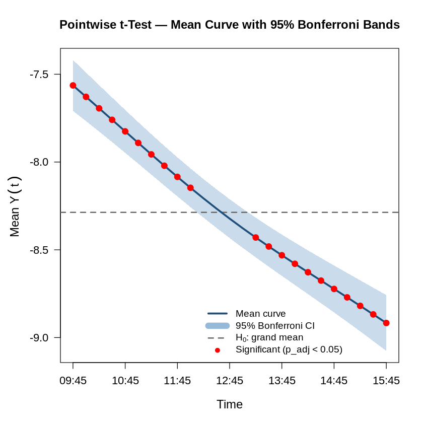
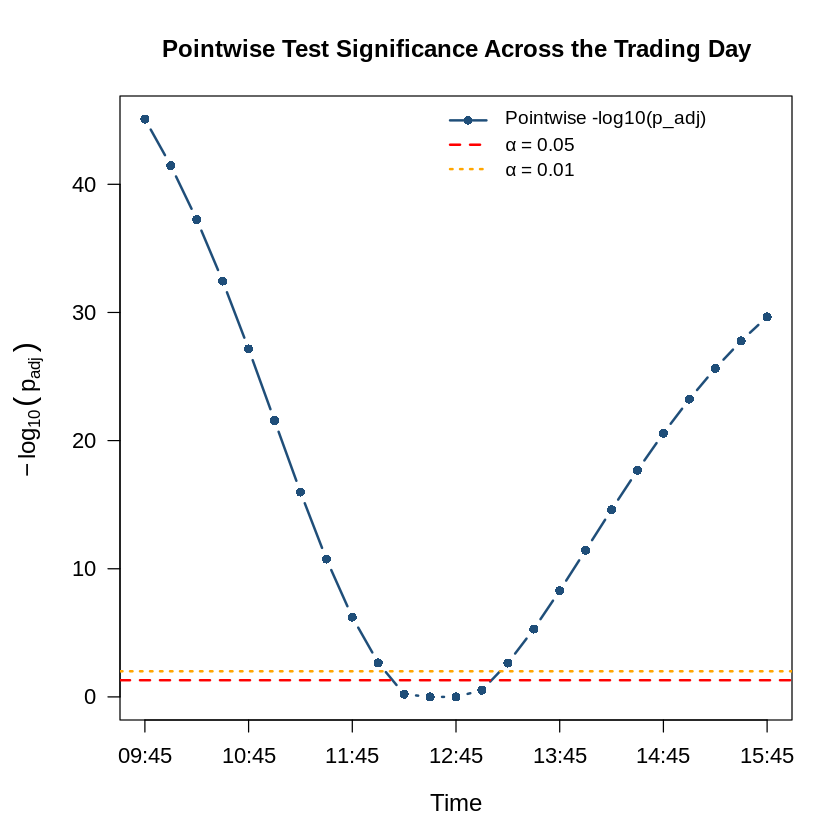
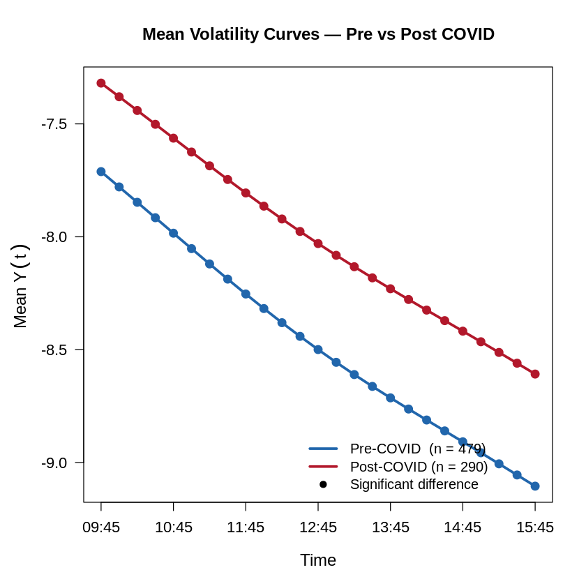
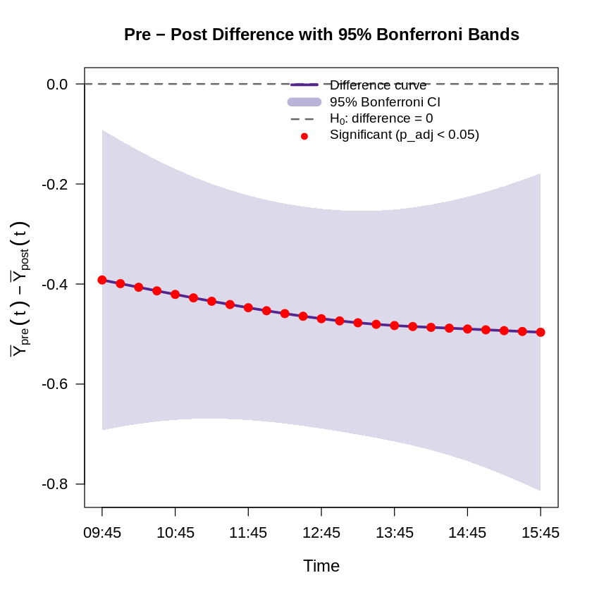
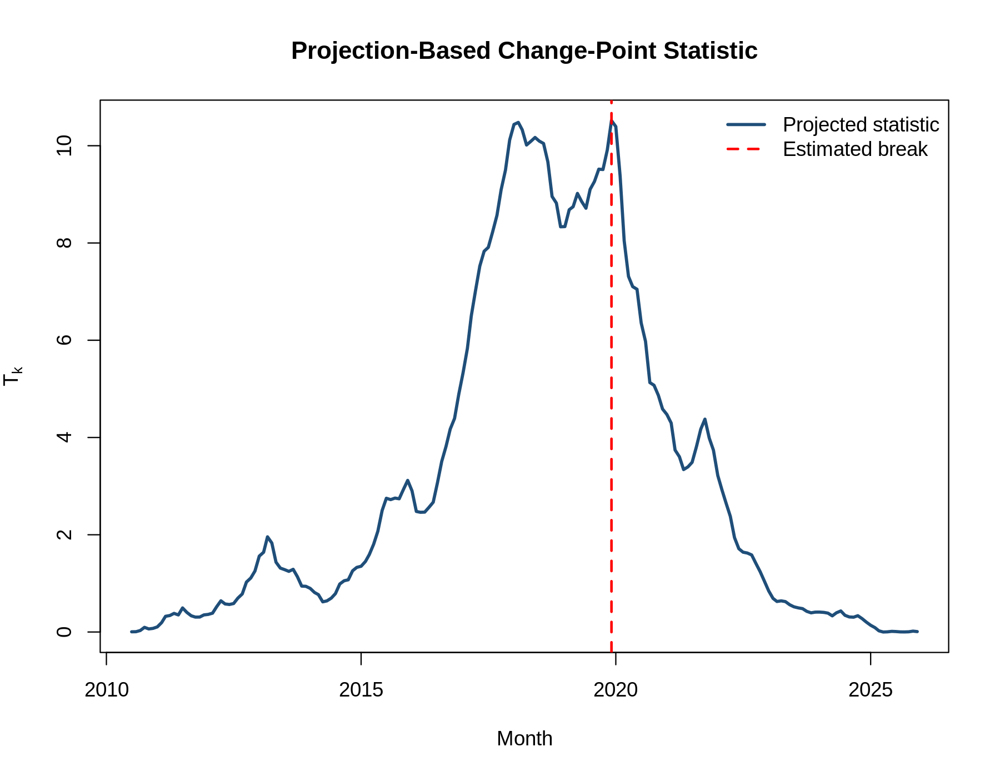
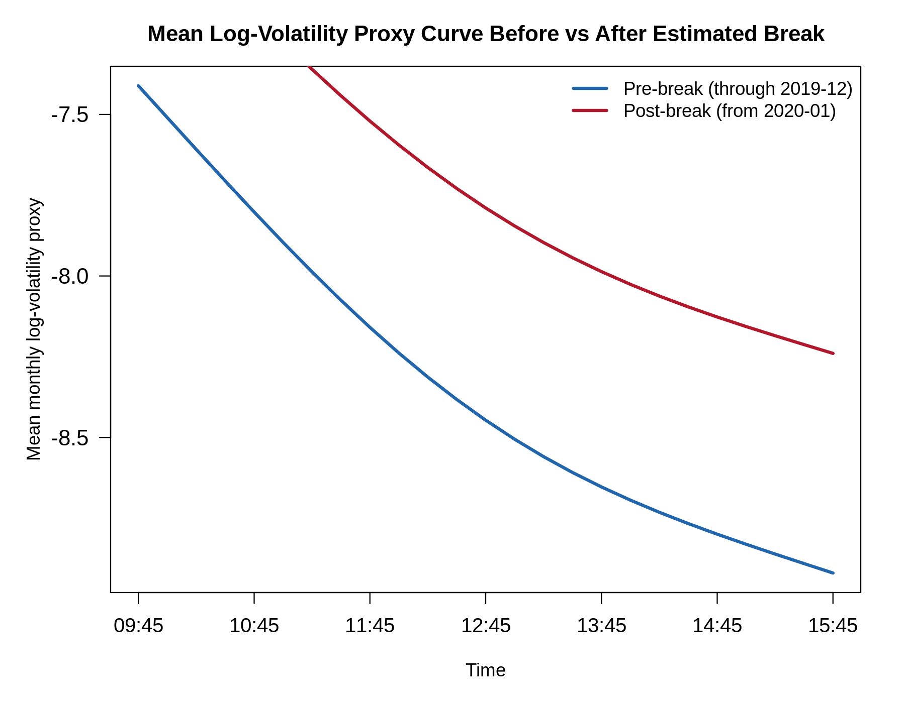
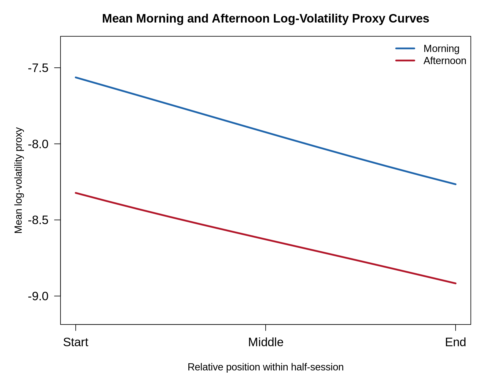
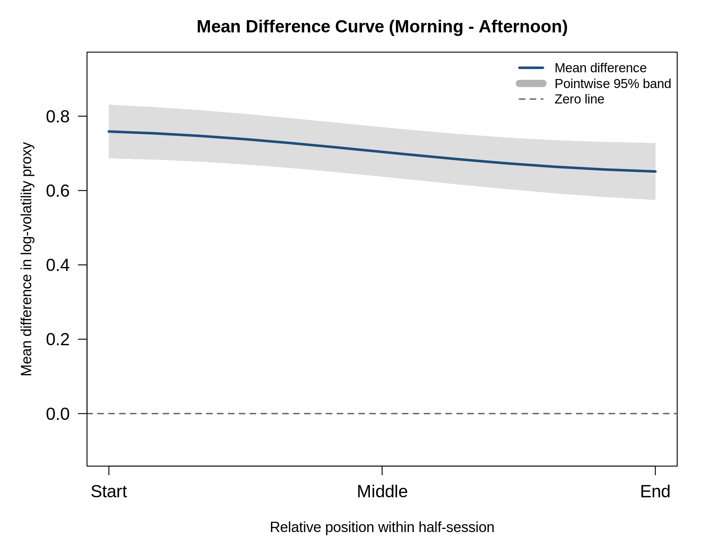

# Functional Data Analysis for Intraday Volatility of $TSLA

## Hypothesis Testing

The section presents 5 inferential tests used to assess Tesla's intraday functional patterns. We test whether the mean log-volatility curve is flat over the trading day, whether the volatility structure changed around the COVID period, whether structural breaks are present in the mean function, whether weekday effects exist in volatility and volume-related curves, and whether morning and afternoon volatility profiles differ. All hypothesis tests are conducted at the $0.05$ significance level, unless stated otherwise.

### Intraday Pattern in the Mean Log-Volatility Curve

This hypothesis tests whether Tesla's mean intraday log-volatility proxy curve is constant across the trading day or whether it exhibits a systematic intraday pattern. The analysis is based on the smoothed log-volatility proxy curves $Y_i(t)$ from the approximately independent subsample, consisting of 769 days, where $i$ indexes trading days and $t\in[0,1]$ denotes normalized intraday time.

The null hypothesis is defined relative to the overall sample mean level. Let

$$\mu(t)=E[Y_i(t)]$$

denote the mean intraday log-volatility curve, and let

$$\mu_0 = \frac{1}{\lvert \mathcal{T} \rvert}\int_{\mathcal{T}} \mu(t)\,dt$$

denote the flat mean level. In the empirical implementation, this flat level is estimated by the grand mean of all observed smoothed log-volatility values $\hat{\mu}_0=-8.2866$. The test is designed to determine whether the mean curve is flat around its own overall average level, or whether it varies systematically over the trading session.

#### Hypotheses

The null hypothesis is that the mean log-volatility proxy curve is constant across intraday time:

$$H_0:\mu(t)=\mu_0,\qquad \forall t\in\mathcal{T}.$$

The alternative hypothesis is that the mean curve deviates from this flat level for at least some intraday time point:

$$H_1:\mu(t)\neq \mu_0 \quad \text{for some } t\in\mathcal{T}.$$

#### Global Functional Test Results

The global hypothesis is tested using a one-sample functional $L^2$-norm statistic. Let

$$\bar{Y}(t)=\frac{1}{n}\sum_{i=1}^{n}Y_i(t)$$

denote the sample mean log-volatility curve. The test statistic is

$$T=n\int_{\mathcal{T}}\left[\bar{Y}(t)-\hat{\mu}_0\right]^2\,dt.$$

The results are shown in Table 1, under the assumption that $H_0$ is rejected if the $p$-value falls below the $0.05$ threshold level.

**Table 1. Global functional $L^2$ test for a non-flat intraday mean curve.**

| Test | Statistic | $p$-value | Decision |
|---|---:|---:|---|
| Global functional $L^2$ test | 117.4368 | 0.0002 | Reject $H_0$ |

The global test yields a $p$-value below the $0.05$ significance level. Therefore, the null hypothesis that Tesla's mean intraday log-volatility proxy curve is flat is rejected.

<details>
<summary>R code</summary>

```r
X_test <- Y_sel_smooth
n_test <- nrow(X_test)

grand_mean <- mean(X_test)
X_dev <- X_test - grand_mean

trapz_int <- function(x, y) {
  sum(diff(x) * (head(y, -1) + tail(y, -1)) / 2)
}

l2_stat <- function(dev_matrix, grid) {
  mean_dev <- colMeans(dev_matrix)
  nrow(dev_matrix) * trapz_int(grid, mean_dev^2)
}

T_obs <- l2_stat(X_dev, t_grid)

set.seed(42)
B <- 4999
T_perm <- numeric(B)

for (b in seq_len(B)) {
  signs <- sample(c(-1, 1), size = n_test, replace = TRUE)

  X_perm <- X_dev * matrix(
    signs,
    nrow = n_test,
    ncol = ncol(X_dev)
  )

  T_perm[b] <- l2_stat(X_perm, t_grid)
}

p_global <- (1 + sum(T_perm >= T_obs)) / (B + 1)

global_l2_results <- data.frame(
  test      = "Global functional L2 test",
  statistic = T_obs,
  p_value   = p_global,
  decision  = ifelse(
    p_global < 0.05,
    "Reject H0",
    "Fail to reject H0"
  )
)

global_l2_results
```

</details>

#### Pointwise Tests

To identify where the mean curve differs from the flat null level, pointwise $t$-tests are also performed at each of the 25 intraday time points. For each time point $t_j$, the test statistic is

$$t_j=\frac{\bar{Y}(t_j)-\hat{\mu}_0}{s(t_j)/\sqrt{n}}.$$

where $s(t_j)$ is the sample standard deviation of $Y_i(t_j)$ across days. The pointwise null and alternative hypotheses are

$$H_{0,j}:\mu(t_j)=\mu_0.$$

and

$$H_{1,j}:\mu(t_j)\neq \mu_0.$$

Because 25 pointwise tests are conducted, Bonferroni correction is applied to control for multiple testing.

The pointwise results show that 21 out of 25 time points remain statistically significant after Bonferroni correction. The only non-significant time points occur around the middle of the session, at 165, 180, 195, and 210 minutes after the first return interval. These correspond approximately to the period from 12:15 to 13:00. Thus, the mean curve differs significantly from the flat grand-mean level for most of the trading day, except around the midday region where the curve crosses its overall average level.

**Table 2. Summary of Bonferroni-corrected pointwise tests.**

| Quantity | Result |
|---|---:|
| Number of intraday time points | 25 |
| Significant after Bonferroni correction | 21 |
| Non-significant time points | 165, 180, 195, 210 minutes |
| Significance threshold | $0.05$ |

The estimated mean curve is above the grand mean during the early part of the session and below the grand mean during the later part of the session: Tesla's average intraday log-volatility proxy is relatively high near the beginning of the day and gradually declines as the session progresses.

| Mean log-volatility curve with Bonferroni-adjusted confidence bands | Pointwise test significance across the trading day |
|---|---|
|  |  |

<details>
<summary>R code</summary>

```r
pointwise_mean <- colMeans(X_test)
pointwise_sd   <- apply(X_test, 2, sd)
pointwise_se   <- pointwise_sd / sqrt(n_test)

t_stats <- (pointwise_mean - grand_mean) / pointwise_se
p_vals  <- 2 * pt(-abs(t_stats), df = n_test - 1)
p_vals_adj <- pmin(p_vals * ncol(X_test), 1)

alpha <- 0.05
t_crit <- qt(
  1 - alpha / (2 * ncol(X_test)),
  df = n_test - 1
)

ci_lower <- pointwise_mean - t_crit * pointwise_se
ci_upper <- pointwise_mean + t_crit * pointwise_se

pointwise_results <- data.frame(
  time_min  = t_actual,
  mean_Y    = pointwise_mean,
  t_stat    = t_stats,
  p_value   = p_vals,
  p_adj     = p_vals_adj,
  signif_05 = p_vals_adj < 0.05
)

pointwise_summary <- data.frame(
  n_time_points = ncol(X_test),
  n_significant = sum(pointwise_results$signif_05),
  alpha         = 0.05
)

pointwise_results
pointwise_summary
```

</details>

#### Interpretation

The global functional $L^2$ test and the pointwise tests both indicate that Tesla's mean intraday log-volatility proxy curve is not flat. The rejection of the global null hypothesis shows that the intraday volatility profile contains statistically significant structure.

The pointwise tests disclose that most time points are significantly different from the grand mean level after Bonferroni correction. The non-significant points are concentrated around midday, where the mean curve is closest to the overall daily average. This suggests that the mean log-volatility curve transitions from above-average levels early in the trading session to below-average levels later in the day.

The pattern is consistent with the idea that the beginning of the trading session reflects the market's adjustment to overnight information, pre-market news, and order imbalances accumulated before the open. As this information is gradually incorporated into prices, the average volatility level decreases. The absence of significance around midday indicates that this period is closest to the overall average volatility level.

We find strong evidence of a systematic intraday volatility pattern in Tesla's trading behavior: the mean log-volatility proxy is not constant over the day, with higher average volatility early in the session and lower average volatility later in the session.

### COVID Structural Change in Mean Intraday Volatility Curves

The COVID-19 period provides a natural breakpoint for assessing whether Tesla's intraday volatility dynamics entered a different regime. To evaluate this possibility, the smoothed log-volatility proxy curves are divided into pre-COVID and post-COVID samples using 11 March 2020 as the cutoff date, corresponding to the World Health Organization's declaration of COVID-19 as a global pandemic. As in the previous tests, the response variable is the smoothed intraday log-volatility proxy curve $Y_i(t)$, where $i$ indexes trading days and $t\in[0,1]$ denotes normalized intraday time. In the approximately independent subsample, the pre-COVID group contains 479 curves, while post-COVID group consists of 290 curves.

#### Hypotheses

The null hypothesis is that the two mean intraday log-volatility proxy functions are identical over the full intraday domain:

$$H_0:\mu_{\mathrm{pre}}(t)=\mu_{\mathrm{post}}(t),\qquad \forall t\in\mathcal{T}.$$

The alternative hypothesis is that the mean curves differ for at least some point of the trading day:

$$H_1:\mu_{\mathrm{pre}}(t)\neq\mu_{\mathrm{post}}(t)\quad \text{for some } t\in\mathcal{T}.$$

#### Global Functional Test Results

To test the global difference between the two mean curves, we use a two-sample functional $L^2$ statistic based on the integrated squared distance between the pre-COVID and post-COVID sample mean functions. Let

$$\bar{Y}_{\mathrm{pre}}(t)=\frac{1}{n_1}\sum_{i\in \mathrm{pre}}Y_i(t),\qquad \bar{Y}_{\mathrm{post}}(t)=\frac{1}{n_2}\sum_{i\in \mathrm{post}}Y_i(t).$$

denote the two group mean curves. The test statistic is

$$T=\int_{\mathcal{T}}\left[\bar{Y}_{\mathrm{pre}}(t)-\bar{Y}_{\mathrm{post}}(t)\right]^2\,dt.$$

**Table 3. Global functional test for pre-COVID versus post-COVID mean curves.**

| Test | Statistic | $p$-value | Decision |
|---|---:|---:|---|
| Two-sample functional $L^2$ test | 0.211999 | 0.0002 | Reject $H_0$ |

We reject the null hypothesis of equal pre-COVID and post-COVID mean intraday log-volatility curves as the global test produces a $p$-value of $0.0002$ as shown in Table 3.

<details>
<summary>R code</summary>

```r
covid_date <- as.Date("2020-03-11")

pre_idx  <- which(days_sel <  covid_date)
post_idx <- which(days_sel >= covid_date)

X_pre  <- Y_sel_smooth[pre_idx,  , drop = FALSE]
X_post <- Y_sel_smooth[post_idx, , drop = FALSE]

n1 <- nrow(X_pre)
n2 <- nrow(X_post)

trapz_int <- function(x, y) {
  sum(diff(x) * (head(y, -1) + tail(y, -1)) / 2)
}

twosample_l2_stat <- function(X1, X2, grid) {
  mean_diff <- colMeans(X1) - colMeans(X2)
  trapz_int(grid, mean_diff^2)
}

T_obs <- twosample_l2_stat(X_pre, X_post, t_grid)

set.seed(42)
B <- 4999

X_combined <- rbind(X_pre, X_post)
n_total <- nrow(X_combined)

T_perm <- numeric(B)

for (b in seq_len(B)) {
  perm_idx <- sample(n_total)

  X1_perm <- X_combined[
    perm_idx[1:n1],
    ,
    drop = FALSE
  ]

  X2_perm <- X_combined[
    perm_idx[(n1 + 1):n_total],
    ,
    drop = FALSE
  ]

  T_perm[b] <- twosample_l2_stat(X1_perm, X2_perm, t_grid)
}

p_global <- (1 + sum(T_perm >= T_obs)) / (B + 1)

covid_global_results <- data.frame(
  break_date = covid_date,
  n_pre      = n1,
  n_post     = n2,
  date_pre   = paste(min(days_sel[pre_idx]), max(days_sel[pre_idx]), sep = " to "),
  date_post  = paste(min(days_sel[post_idx]), max(days_sel[post_idx]), sep = " to "),
  statistic  = T_obs,
  p_value    = p_global,
  decision   = ifelse(
    p_global < 0.05,
    "Reject H0",
    "Fail to reject H0"
  )
)

covid_global_results
```

</details>

#### Pointwise Welch Tests

The global test establishes that the two mean functions differ somewhere over the intraday domain, but it does not by itself indicate whether the difference is concentrated at specific times of day or persists throughout the session. To examine this, pointwise Welch tests are performed at each of the 25 intraday time points.

For each time point $t_j$, the pointwise null hypothesis is

$$H_{0,j}:\mu_{\mathrm{pre}}(t_j)=\mu_{\mathrm{post}}(t_j).$$

against the alternative

$$H_{1,j}:\mu_{\mathrm{pre}}(t_j)\neq\mu_{\mathrm{post}}(t_j).$$

The Welch statistic is used because the variability of the log-volatility curves may differ between the pre-COVID and post-COVID periods. For each time point, the statistic has the form

$$t_j=\frac{\bar{Y}_{\mathrm{pre}}(t_j)-\bar{Y}_{\mathrm{post}}(t_j)}{\sqrt{s_{\mathrm{pre}}^2(t_j)/n_1+s_{\mathrm{post}}^2(t_j)/n_2}}.$$

where $s_{\mathrm{pre}}(t_j)$ and $s_{\mathrm{post}}(t_j)$ are the sample standard deviations at time $t_j$ in the two groups.

As given in the Table 4, the pointwise Welch tests show that all 25 intraday time points remain statistically significant after Bonferroni correction.

**Table 4. Summary of Bonferroni-corrected pointwise Welch tests.**

| Quantity | Result |
|---|---:|
| Number of intraday time points | 25 |
| Significant after Bonferroni correction | 25 |
| Largest adjusted $p$-value | 0.00134 |
| Significance threshold | 0.05 |

The estimated difference is negative at every intraday time point and ranges approximately from $-0.392$ at the beginning of the session to $-0.496$ near the end of the session. There is a statistically significant proof that Tesla's post-COVID intraday volatility level is systematically higher than its pre-COVID level.

<details>
<summary>R code</summary>

```r
mean_pre  <- colMeans(X_pre)
mean_post <- colMeans(X_post)

sd_pre  <- apply(X_pre,  2, sd)
sd_post <- apply(X_post, 2, sd)

mean_diff <- mean_pre - mean_post

welch_stats <- numeric(ncol(X_pre))
welch_pvals <- numeric(ncol(X_pre))
welch_df    <- numeric(ncol(X_pre))

for (j in seq_len(ncol(X_pre))) {
  test_j <- t.test(
    X_pre[, j],
    X_post[, j],
    var.equal = FALSE
  )

  welch_stats[j] <- unname(test_j$statistic)
  welch_pvals[j] <- test_j$p.value
  welch_df[j]    <- unname(test_j$parameter)
}

welch_pvals_adj <- pmin(
  welch_pvals * ncol(X_pre),
  1
)

se_diff <- sqrt(sd_pre^2 / n1 + sd_post^2 / n2)

alpha <- 0.05

t_crit <- qt(
  1 - alpha / (2 * ncol(X_pre)),
  df = welch_df
)

ci_lower <- mean_diff - t_crit * se_diff
ci_upper <- mean_diff + t_crit * se_diff

covid_pointwise_results <- data.frame(
  time_min  = t_actual,
  mean_pre  = mean_pre,
  mean_post = mean_post,
  diff      = mean_diff,
  welch_t   = welch_stats,
  df        = welch_df,
  p_value   = welch_pvals,
  p_adj     = welch_pvals_adj,
  signif_05 = welch_pvals_adj < 0.05
)

covid_pointwise_summary <- data.frame(
  n_time_points = ncol(X_pre),
  n_significant = sum(covid_pointwise_results$signif_05),
  max_p_adj     = max(covid_pointwise_results$p_adj),
  alpha         = 0.05
)

covid_pointwise_results
covid_pointwise_summary
```

</details>

#### Interpretation

The results indicate that there exists a structural shift in Tesla's intraday log-volatility profile after the COVID break date. The global functional test rejects equality of the two mean curves, and the pointwise Welch tests show that the difference is significant at every intraday time point after Bonferroni correction.

The direction of the effect is also consistent across the session. The difference is negative at all 25 time points, implying that the post-COVID period has a higher mean log-volatility proxy throughout the day.

From an economic point of view, the post-COVID period includes a substantial increase in market uncertainty, a sharp rise in retail participation, large changes in Tesla's market capitalization, heightened sensitivity to macroeconomic news, and several episodes of extreme price movement. Tesla also became one of the most actively traded and closely followed stocks during this period. These factors can all contribute to a higher and more persistent intraday volatility regime.

The analysis gives strong statistical evidence that Tesla's mean intraday log-volatility curve changed after the COVID break date. The post-COVID regime is characterized by higher log-volatility across the entire trading session, suggesting a broad upward shift in Tesla's intraday volatility structure rather than a localized change at only a few times of day.

|  Mean log-volatility curves before and after the COVID break date | Pre-minus-post difference curve with Bonferroni-adjusted confidence bands |
|---|---|
|  |  |

### Projection-Based Change-Point Test for the Mean Volatility Function

The previous COVID structural-change analysis imposed a fixed break date, 11 March 2020, and compared the mean intraday volatility curves before and after that date. A complementary approach is to estimate the break date directly from the data. For this purpose, we apply a projection-based change-point test to determine whether mean intraday log-volatility curve remains stable over time or whether there is evidence of a structural shift in the mean function.

Because the original daily curves form a time-ordered financial sequence and are unlikely to be independent, the test is not applied directly to all daily curves. Instead, the full smoothed daily sequence is aggregated into monthly mean curves. This aggregation reduces short-run serial dependence and smooths out high-frequency daily noise, although it does not completely remove temporal dependence because the resulting monthly curves remain chronologically ordered. The resulting monthly curve matrix contains 187 monthly mean curves observed at 25 intraday time points, covering the period from July 2010 to January 2026.

<details>
<summary>R code</summary>

```r
X_full_cp <- Y_full_smooth
time_full_cp <- days_full

month_id <- floor_date(time_full_cp, unit = "month")

month_counts <- table(month_id)
keep_months <- names(month_counts[month_counts >= 10])

keep_idx <- as.character(month_id) %in% keep_months

X_full_cp_use <- X_full_cp[keep_idx, , drop = FALSE]
time_full_use <- time_full_cp[keep_idx]
month_id_use  <- floor_date(time_full_use, unit = "month")

month_levels <- sort(unique(month_id_use))

X_month <- t(sapply(month_levels, function(m) {
  colMeans(X_full_cp_use[month_id_use == m, , drop = FALSE])
}))

month_dates <- as.Date(month_levels)

monthly_curve_summary <- data.frame(
  n_months    = nrow(X_month),
  n_time_pts  = ncol(X_month),
  start_month = min(month_dates),
  end_month   = max(month_dates)
)

monthly_curve_summary
```

</details>

#### Hypotheses

Let $X_m(t)$ denote the monthly mean log-volatility proxy curve for month $m$, where $m=1,\ldots,M$ and $M=187$. The null hypothesis states that the mean function is constant over time:

$$H_0:\mu_1(t)=\mu_2(t)=\cdots=\mu_M(t),\qquad \forall t\in\mathcal{T}.$$

The alternative hypothesis allows for one unknown structural break. That is, there exists a change point $k^\ast$ such that

$$H_1:\mu_1(t)=\cdots=\mu_{k^\ast}(t)\neq\mu_{k^\ast+1}(t)=\cdots=\mu_M(t),\qquad \text{for some } t\in\mathcal{T}.$$

Unlike the previous pre/post COVID test, the breakpoint is not fixed in advance but is estimated from the functional time series.

#### Projection-Based Test Results

Firstly, we center the monthly curves and project them onto the leading principal components. Here $\xi_{m\ell}$ denotes the score of month $m$ on principal component $\ell$, and $\lambda_\ell$ is the corresponding eigenvalue. The number of retained principal components, $d$, is selected using an 85% fraction-of-variance-explained rule, which in our case resulted in the first principal component alone being sufficient, so $d=1$.

For each candidate breakpoint $k$, the test computes cumulative deviations of the projected scores from their overall mean level:

$$C_{k\ell}=\sum_{m=1}^{k}\xi_{m\ell}-\frac{k}{M}\sum_{m=1}^{M}\xi_{m\ell}.$$

The corresponding projected change-point statistic is

$$T_k=\sum_{\ell=1}^{d}\frac{C_{k\ell}^2}{M\lambda_\ell}.$$

The overall test statistic is the maximum over all possible break locations:

$$T_{\max}=\max_{1\leq k<M}T_k.$$

**Table 5. Projection-based change-point test for the monthly mean log-volatility function.**

| Quantity | Result |
|---|---:|
| Monthly mean curve matrix | $187 \times 25$ |
| Date range | 2010-07 to 2026-01 |
| Test statistic | 10.5171 |
| $p$-value | 0.0002 |
| Number of PCs used | 1 |
| Estimated break interval | 2019-12 to 2020-01 |
| Decision | Reject $H_0$ |

As presented in Table 5, the statistic's $p$-value is below the significance threshold, thus, the null hypothesis of a time-stable mean function is rejected. The estimated break occurs between December 2019 and January 2020, indicating a structural shift in Tesla's mean intraday log-volatility curve around the beginning of 2020.

<details>
<summary>R code</summary>

```r
projection_cp_test <- function(X, time_index,
                               fve_threshold = 0.85,
                               d_max = 5,
                               B = 5000,
                               seed = 123) {
  X <- as.matrix(X)
  n <- nrow(X)

  if (n < 10) {
    stop("Too few curves for a reliable change-point test.")
  }

  X_centered <- scale(X, center = TRUE, scale = FALSE)

  pca_res <- prcomp(X_centered, center = FALSE, scale. = FALSE)

  lambda <- pca_res$sdev^2

  if (sum(lambda > 1e-10) == 0) {
    stop("No variation in the curves.")
  }

  fve <- cumsum(lambda) / sum(lambda)

  d_fve <- which(fve >= fve_threshold)[1]
  d <- min(d_fve, d_max, sum(lambda > 1e-10))

  scores <- pca_res$x[, 1:d, drop = FALSE]
  lambda_d <- lambda[1:d]

  k_grid <- 1:(n - 1)
  u_grid <- k_grid / n

  cum_scores <- apply(scores, 2, cumsum)
  total_scores <- colSums(scores)

  C_mat <- cum_scores[k_grid, , drop = FALSE] -
    u_grid * matrix(
      total_scores,
      nrow = length(k_grid),
      ncol = d,
      byrow = TRUE
    )

  T_k <- rowSums(
    sweep(C_mat^2, 2, n * lambda_d, "/")
  )

  T_max <- max(T_k)
  k_hat <- k_grid[which.max(T_k)]

  break_left  <- time_index[k_hat]
  break_right <- time_index[k_hat + 1]

  set.seed(seed)

  T_sim <- replicate(B, {
    Z <- matrix(rnorm(n * d), nrow = n, ncol = d)

    cum_Z <- apply(Z, 2, cumsum)
    total_Z <- colSums(Z)

    C_Z <- cum_Z[k_grid, , drop = FALSE] -
      u_grid * matrix(
        total_Z,
        nrow = length(k_grid),
        ncol = d,
        byrow = TRUE
      )

    max(rowSums(C_Z^2 / n))
  })

  p_val <- (1 + sum(T_sim >= T_max)) / (B + 1)

  list(
    statistic   = T_max,
    p.value     = p_val,
    k_hat       = k_hat,
    break_left  = break_left,
    break_right = break_right,
    T_k         = T_k,
    k_grid      = k_grid,
    d           = d,
    lambda      = lambda,
    fve         = fve,
    scores      = scores,
    pca_res     = pca_res,
    time_index  = time_index,
    sim_stats   = T_sim
  )
}

cp_res <- projection_cp_test(
  X             = X_month,
  time_index    = month_dates,
  fve_threshold = 0.85,
  d_max         = 5,
  B             = 5000,
  seed          = 123
)

cp_results <- data.frame(
  statistic   = cp_res$statistic,
  p_value     = cp_res$p.value,
  n_pcs       = cp_res$d,
  break_left  = cp_res$break_left,
  break_right = cp_res$break_right,
  decision    = ifelse(
    cp_res$p.value < 0.05,
    "Reject H0",
    "Fail to reject H0"
  )
)

cp_results
```

</details>

#### Interpretation

The projection-based change-point test provides a data-driven confirmation that Tesla's intraday volatility regime changed around the start of 2020, which complements the previous COVID structural-change test. While the COVID analysis imposed 11 March 2020 as an externally chosen break date, the change-point procedure estimates the location of the break directly from the sequence of monthly mean curves. The estimated break appears slightly earlier, between December 2019 and January 2020, but it points to the same broader transition into a higher-volatility early-2020 regime.

The timing is economically plausible due to a couple of reasons. Firstly, around late 2019 and early 2020, Tesla experienced a major market revaluation, increased investor attention, expansion of vehicle deliveries in China, and a rapid rise in its stock price. Shortly afterward, the COVID shock and the subsequent post-COVID market environment further amplified volatility. Therefore, the estimated break should be interpreted not as a purely pandemic-driven event, but as the beginning of a broader structural transition in Tesla's trading behavior and volatility regime. The fact that only one principal component is selected also suggests that the dominant structural change is primarily a shift in the overall level of the mean log-volatility curve, rather than a highly localized change affecting only a narrow part of the trading day.

Overall, the change-point test strengthens the evidence from the fixed-date COVID comparison. Both approaches reject stability of Tesla's mean intraday log-volatility curve and indicate that the early-2020 period marks a transition into a different volatility regime.

|  Projection-based change-point statistic with estimated break | Mean monthly log-volatility curves before and after the estimated break |
|---|---|
|  |  |

### Weekday Effect on Mean Functional Curves

The analysis of weekday effect on mean function curve is conducted for three functional responses: the smoothed log-volatility proxy curves, the log-volume curves, and the normalized volume-share curves. The main object of interest is the smoothed intraday log-volatility proxy curve,

$$Y_i(t)=\log\left(Z_i(t)^2\right)-q_0.$$

where $i$ indexes trading days, $t\in[0,1]$ denotes normalized intraday time, $Z_i(t)$ is the scaled intraday log-return, and $q_0 = E[\log(W^2)]$ for $W\sim N(0,1)$.

In addition to volatility, we also consider volume-based functional responses. Let $Q_i(t_j)$ denote Tesla's volume on day $i$ at intraday bar $j$. The log-volume curve is defined as

$$L_i(t_j)=\log\left(1+Q_i(t_j)\right).$$

while the normalized volume-share curve is defined as

$$S_i(t_j)=\frac{Q_i(t_j)}{\sum_{\ell=1}^{26}Q_i(t_\ell)}.$$

The log-volume curve measures absolute trading intensity, whereas the normalized volume-share curve measures the relative timing of trading activity within the day. To reduce serial dependence between consecutive trading days, the weekday analysis is performed on the approximately independent subsample rather than on the full daily dataset, as defined earlier.

#### Hypotheses

For a generic functional response $X_i(t)$, let

$$\mu_g(t)=E[X_i(t)\mid G_i=g]$$

denote the weekday-specific mean function. The null hypothesis is that all weekday mean functions are identical:

$$H_0:\mu_{\text{Mon}}(t)=\mu_{\text{Tue}}(t)=\mu_{\text{Wed}}(t)=\mu_{\text{Thu}}(t)=\mu_{\text{Fri}}(t),\qquad \forall t\in\mathcal{T}.$$

The alternative hypothesis is that at least one weekday mean function differs:

$$H_1:\exists\, g\neq h \text{ such that } \mu_g(t)\neq \mu_h(t)\text{ for some } t\in\mathcal{T}.$$

#### Global Test Results

The global weekday-effect hypothesis is tested using a functional one-way ANOVA statistic, which is based on integrated squared deviations from the grand mean. The weekday-specific sample mean curve is

$$\bar{X}_g(t)=\frac{1}{n_g}\sum_{i\in\mathcal{I}_g}X_i(t).$$

and the grand mean curve is

$$\bar{X}(t)=\frac{1}{n}\sum_{i=1}^{n}X_i(t).$$

The global functional ANOVA statistic is

$$T=\sum_{g=1}^{5}n_g\int_{\mathcal{T}}\left[\bar{X}_g(t)-\bar{X}(t)\right]^2\,dt.$$

The global weekday-effect test was applied separately to the smoothed log-volatility curves, log-volume curves, and normalized volume-share curves. The results of the hypothesis testing are present in Table 6, under the assumption that $H_0$ is rejected if the $p$-value falls below the $0.05$ threshold level.

**Table 6. Global functional ANOVA tests for weekday effects.**

| Functional response | Statistic | $p$-value | Decision |
|---|---:|---:|---|
| Smoothed log-volatility $Y_i(t)$ | 7.1181 | 0.1920 | Fail to reject $H_0$ |
| Log-volume $L_i(t)$ | 2.6041 | 0.6795 | Fail to reject $H_0$ |
| Normalized volume share $S_i(t)$ | 0.0018 | 0.0085 | Reject $H_0$ |

For the smoothed log-volatility curves and the log-volume curves, the global permutation tests both produce $p$-values above the $0.05$ significance level. Therefore, in these two cases, we fail to reject the null hypothesis of equal weekday mean functions, which indicates that there is no statistically significant evidence of a weekday effect in either the mean intraday log-volatility profile or the absolute intraday log-volume pattern.

For the normalized volume-share curves, however, the global test produces a $p$-value below $0.05$ threshold. Hence, we reject the null hypothesis of equal weekday mean functions for this response. This suggests that the relative timing of trading volume within the day differs significantly across weekdays.

<details>
<summary>R code</summary>

```r
tsla_vol_sorted <- tsla_clean |>
  arrange(trade_date, bar_rank)

t_vol_grid <- seq(0, 1, length.out = 26L)

trading_days_vol <- sort(unique(tsla_vol_sorted$trade_date))
n_days_vol <- length(trading_days_vol)

volume_matrix <- matrix(
  tsla_vol_sorted$volume,
  nrow  = n_days_vol,
  ncol  = 26L,
  byrow = TRUE
)

rownames(volume_matrix) <- as.character(trading_days_vol)
colnames(volume_matrix) <- paste0("bar", seq_len(26L))

volume_sel <- volume_matrix[
  match(as.character(days_sel), rownames(volume_matrix)),
  ,
  drop = FALSE
]

logvol_sel   <- log1p(volume_sel)
volshare_sel <- volume_sel / rowSums(volume_sel)

weekday_grp <- factor(
  weekdays(days_sel),
  levels = c("Monday", "Tuesday", "Wednesday", "Thursday", "Friday")
)

trapz_sq <- function(grid, y) {
  sum(diff(grid) * (head(y^2, -1) + tail(y^2, -1)) / 2)
}

anova_l2_stat <- function(X, grp, grid) {
  grp <- droplevels(factor(grp))

  grand_mean <- colMeans(X)
  group_indices <- split(seq_len(nrow(X)), grp)

  stat <- 0

  for (idx in group_indices) {
    group_mean <- colMeans(X[idx, , drop = FALSE])
    stat <- stat + length(idx) * trapz_sq(grid, group_mean - grand_mean)
  }

  stat
}

perm_fanova_l2 <- function(X, grp, grid, B = 1999, seed = 123) {
  set.seed(seed)

  grp <- droplevels(factor(grp))
  T_obs <- anova_l2_stat(X, grp, grid)

  T_perm <- replicate(B, {
    grp_perm <- sample(grp, replace = FALSE)
    anova_l2_stat(X, grp_perm, grid)
  })

  p_val <- (1 + sum(T_perm >= T_obs)) / (B + 1)

  list(
    statistic = T_obs,
    p.value   = p_val
  )
}

fanova_res_volatility <- perm_fanova_l2(
  X    = Y_sel_smooth,
  grp  = weekday_grp,
  grid = t_grid,
  B    = 1999,
  seed = 123
)

fanova_res_logvolume <- perm_fanova_l2(
  X    = logvol_sel,
  grp  = weekday_grp,
  grid = t_vol_grid,
  B    = 1999,
  seed = 123
)

fanova_res_volshare <- perm_fanova_l2(
  X    = volshare_sel,
  grp  = weekday_grp,
  grid = t_vol_grid,
  B    = 1999,
  seed = 123
)

global_weekday_results <- data.frame(
  response = c(
    "Smoothed log-volatility",
    "Log-volume",
    "Normalized volume share"
  ),
  statistic = c(
    fanova_res_volatility$statistic,
    fanova_res_logvolume$statistic,
    fanova_res_volshare$statistic
  ),
  p_value = c(
    fanova_res_volatility$p.value,
    fanova_res_logvolume$p.value,
    fanova_res_volshare$p.value
  )
)

global_weekday_results$decision <- ifelse(
  global_weekday_results$p_value < 0.05,
  "Reject H0",
  "Fail to reject H0"
)

global_weekday_results
```
</details>

#### Post-Hoc Pairwise Functional Tests

Because the global test for normalized volume-share curves is significant, post-hoc pairwise functional comparisons are used to identify which weekday pairs drive the rejection. For each pair of weekday groups $g$ and $h$, the pairwise null hypothesis is that the two weekday mean functions are identical over the full intraday domain:

$$H_{0,gh}:\mu_g(t)=\mu_h(t),\qquad \forall t\in\mathcal{T}.$$

The corresponding alternative hypothesis is that the two mean functions differ for at least some intraday time point:

$$H_{1,gh}:\mu_g(t)\neq \mu_h(t)\quad \text{for some } t\in\mathcal{T}.$$

The hypothesis is tested using the two-sample functional $L^2$-statistic:

$$T_{gh}=\frac{n_g n_h}{n_g+n_h}\int_{\mathcal{T}}\left[\bar{X}_g(t)-\bar{X}_h(t)\right]^2\,dt.$$

with Holm corrections applied to control for multiple permutation testing.

The 5 pairs with the smallest $p$-values in the post-hoc tests for normalized volume-share curves are reported in Table 7.

**Table 7. Post-hoc pairwise functional tests for normalized volume-share curves.**

| Group 1 | Group 2 | $n_1$ | $n_2$ | Statistic | Raw $p$ | Holm $p$ | Decision |
|---|---|---:|---:|---:|---:|---:|---|
| Tuesday | Friday | 165 | 133 | 0.000833 | 0.0015 | 0.0150 | Reject $H_0$ |
| Monday | Friday | 104 | 133 | 0.000614 | 0.0230 | 0.1890 | Fail to reject $H_0$ |
| Thursday | Friday | 180 | 133 | 0.000612 | 0.0210 | 0.1890 | Fail to reject $H_0$ |
| Tuesday | Wednesday | 165 | 187 | 0.000536 | 0.0345 | 0.2415 | Fail to reject $H_0$ |
| Wednesday | Friday | 187 | 133 | 0.000514 | 0.0625 | 0.3750 | Fail to reject $H_0$ |

As seen in Table 7, only the Tuesday-Friday comparison remains significant after Holm correction. Therefore, the null hypothesis for this pair is rejected, meaning that the mean normalized intraday volume-share curve for Tuesdays differs significantly from the mean curve for Fridays - the relative allocation of trading volume across the trading day is not the same on Tuesdays and Fridays.

As for the pairwise comparison for log-volatility and log-volume curves, no pair remains significant after Holm correction: the lowest $p$-values are $p_{\mathrm{Holm}}=0.255$ and $p_{\mathrm{Holm}}=1.000$, respectively. Thus, the pairwise analysis is consistent with the global result: there is no statistically significant weekday effect in the log-volatility and log-volume curves.

<details>
<summary>R code</summary>

```r
twosample_l2_stat <- function(X1, X2, grid) {
  n1 <- nrow(X1)
  n2 <- nrow(X2)

  mean_diff <- colMeans(X1) - colMeans(X2)

  (n1 * n2 / (n1 + n2)) * trapz_sq(grid, mean_diff)
}

perm_pairwise_l2 <- function(X, grp, g1, g2, grid, B = 1999, seed = 123) {
  idx <- grp %in% c(g1, g2)

  X_sub <- X[idx, , drop = FALSE]
  grp_sub <- droplevels(factor(grp[idx]))

  X1 <- X_sub[grp_sub == g1, , drop = FALSE]
  X2 <- X_sub[grp_sub == g2, , drop = FALSE]

  T_obs <- twosample_l2_stat(X1, X2, grid)

  set.seed(seed)

  T_perm <- replicate(B, {
    grp_perm <- sample(grp_sub, replace = FALSE)

    X1_perm <- X_sub[grp_perm == g1, , drop = FALSE]
    X2_perm <- X_sub[grp_perm == g2, , drop = FALSE]

    twosample_l2_stat(X1_perm, X2_perm, grid)
  })

  p_val <- (1 + sum(T_perm >= T_obs)) / (B + 1)

  data.frame(
    group1    = g1,
    group2    = g2,
    n1        = nrow(X1),
    n2        = nrow(X2),
    statistic = T_obs,
    p_value   = p_val
  )
}

run_pairwise_tests <- function(X, grp, grid, B = 1999) {
  weekday_levels <- levels(droplevels(factor(grp)))
  pair_list <- combn(weekday_levels, 2, simplify = FALSE)

  pairwise_results <- do.call(
    rbind,
    lapply(seq_along(pair_list), function(i) {
      g1 <- pair_list[[i]][1]
      g2 <- pair_list[[i]][2]

      perm_pairwise_l2(
        X    = X,
        grp  = grp,
        g1   = g1,
        g2   = g2,
        grid = grid,
        B    = B,
        seed = 100 + i
      )
    })
  )

  pairwise_results$p_holm <- p.adjust(
    pairwise_results$p_value,
    method = "holm"
  )

  pairwise_results$p_bonf <- p.adjust(
    pairwise_results$p_value,
    method = "bonferroni"
  )

  pairwise_results$decision <- ifelse(
    pairwise_results$p_holm < 0.05,
    "Reject H0",
    "Fail to reject H0"
  )

  pairwise_results[order(pairwise_results$p_holm), ]
}

pairwise_res_volatility <- run_pairwise_tests(
  X    = Y_sel_smooth,
  grp  = weekday_grp,
  grid = t_grid,
  B    = 1999
)

pairwise_res_logvolume <- run_pairwise_tests(
  X    = logvol_sel,
  grp  = weekday_grp,
  grid = t_vol_grid,
  B    = 1999
)

pairwise_res_volshare <- run_pairwise_tests(
  X    = volshare_sel,
  grp  = weekday_grp,
  grid = t_vol_grid,
  B    = 1999
)

head(pairwise_res_volshare, 5)
```
</details>

#### Interpretation

The results show that Tesla's mean intraday log-volatility profile does not differ significantly across weekdays. Any log-volatility deviations are not large enough relative to within-group variability to reject the null hypothesis of equal weekday mean functions.

Similarly, the log-volume results provide no evidence that absolute intraday trading intensity differs systematically by weekday. On the other hand, we identify that the normalized volume-share curves show a significant weekday effect. Because normalized volume shares remove the effect of total daily volume, this result is interpreted as evidence that the timing of trading activity within the trading day differs across weekdays, rather than the total amount of trading transactions. The post-hoc tests indicate that this effect is primarily driven by the Tuesday-Friday difference. Economically, this may reflect the difference in the beginning-of-week and end-of-week trading behavior, and reduced willingness to carry risk over the weekend. Interestingly, the Monday-Friday comparison is not statistically significant, even though both days are on the opposite sides of the trading week. We believe that the comparison is not significant as Monday may capture the market's adjustment to information accumulated over the weekend, potentially leading to elevated trading activity early in the session. Friday, in turn, may reflect raised trading activity early in the session due to end-of-week trading motives, such as portfolio rebalancing, position closing, or reduced willingness to carry risk over the weekend. By contrast, Tuesday may represent a more typical trading day after the weekend-related information has already been incorporated into prices on Monday. Consequently, the timing of larger volume shares may occur later on Tuesday than on Friday, which provides a plausible explanation for why the Tuesday-Friday comparison is the only one that remains statistically significant. On the other hand, the differences in the timing of volume do not translate into statistically significant differences in the intraday log-volatility curve.

Overall, the weekday-effect analysis supports the following conclusion: there is no statistically significant weekday effect in Tesla's mean intraday log-volatility curve or in its absolute log-volume curve, but there is significant evidence of a weekday effect in the relative intraday allocation of trading volume, mainly driven by the Tuesday-Friday comparison.

### Morning-Afternoon Difference in Intraday Volatility Curves

This section investigates whether Tesla's intraday log-volatility proxy $Y_i(t)$ differs systematically between the morning and afternoon parts of the trading session. Each daily curve is split into two parts: the first 12 intraday return observations are treated as the morning segment $M_i$, and the remaining 13 observations are treated as the afternoon segment $A_i$. Since the two segments contain different numbers of observations, both are interpolated onto a common normalized grid $u\in[0,1]$. The paired difference curve is defined as

$$D_i(u)=M_i(u)-A_i(u),\qquad u\in[0,1].$$

Positive values of $D_i(u)$ therefore indicate that the morning log-volatility proxy is higher than the afternoon log-volatility proxy at the corresponding relative position within the half-session.

#### Hypotheses

The null hypothesis is that the mean morning and afternoon volatility curves are equal over the full normalized half-session domain:

$$H_0:\mu_D(u)=E[D_i(u)]=0,\qquad \forall u\in[0,1].$$

The alternative hypothesis is that the two mean curves differ for at least some relative time point:

$$H_1:\mu_D(u)\neq 0\quad \text{for some } u\in[0,1].$$

#### Functional Paired Test Results

As the morning and afternoon curves are observed for the same trading day, the hypothesis is tested using a paired one-sample functional $L^2$-statistic applied to the difference curves:

$$T=n\int_0^1\bar{D}(u)^2\,du.$$

where $\bar{D}(u)$ is the sample mean difference curve

$$\bar{D}(u)=\frac{1}{n}\sum_{i=1}^{n}D_i(u).$$

**Table 8. Paired functional test for morning-afternoon volatility difference.**

| Test | Statistic | $p$-value | Decision |
|---|---:|---:|---|
| Paired one-sample functional $L^2$ test | 382.4827 | 0.0002 | Reject $H_0$ |

As reported in Table 8, the $p$-value is below the $0.05$ significance level. Therefore, we reject the null hypothesis of equal morning and afternoon mean volatility curves. Thus, there is statistically significant evidence that Tesla's mean log-volatility proxy differs between the two parts of the trading session.

<details>
<summary>R code</summary>

```r
Y_test <- Y_sel_smooth

n_obs <- ncol(Y_test)
n_morning <- 12L

mor_idx <- 1:n_morning
aft_idx <- (n_morning + 1):n_obs

Y_morning   <- Y_test[, mor_idx, drop = FALSE]
Y_afternoon <- Y_test[, aft_idx, drop = FALSE]

t_morning_norm   <- seq(0, 1, length.out = ncol(Y_morning))
t_afternoon_norm <- seq(0, 1, length.out = ncol(Y_afternoon))
u_grid <- seq(0, 1, length.out = 101)

interp_rows <- function(X, x_from, x_to) {
  t(vapply(seq_len(nrow(X)), function(i) {
    approx(
      x    = x_from,
      y    = X[i, ],
      xout = x_to,
      rule = 2
    )$y
  }, FUN.VALUE = numeric(length(x_to))))
}

M_common <- interp_rows(Y_morning,   t_morning_norm,   u_grid)
A_common <- interp_rows(Y_afternoon, t_afternoon_norm, u_grid)

D_common <- M_common - A_common

trapz_integral <- function(x, y) {
  sum(diff(x) * (head(y, -1) + tail(y, -1)) / 2)
}

l2_onesample_stat <- function(D, grid) {
  mean_D <- colMeans(D)
  nrow(D) * trapz_integral(grid, mean_D^2)
}

paired_l2_test <- function(D, grid, B = 4999, seed = 123) {
  set.seed(seed)

  n <- nrow(D)
  T_obs <- l2_onesample_stat(D, grid)

  T_perm <- replicate(B, {
    signs <- sample(c(-1, 1), size = n, replace = TRUE)
    D_star <- D * matrix(signs, nrow = n, ncol = ncol(D))
    l2_onesample_stat(D_star, grid)
  })

  p_val <- (1 + sum(T_perm >= T_obs)) / (B + 1)

  list(
    statistic = T_obs,
    p.value   = p_val
  )
}

morning_afternoon_res <- paired_l2_test(
  D    = D_common,
  grid = u_grid,
  B    = 4999,
  seed = 123
)

morning_afternoon_results <- data.frame(
  test      = "Paired one-sample functional L2 test",
  statistic = morning_afternoon_res$statistic,
  p_value   = morning_afternoon_res$p.value,
  decision  = ifelse(
    morning_afternoon_res$p.value < 0.05,
    "Reject H0",
    "Fail to reject H0"
  )
)

morning_afternoon_results
```

</details>

As a robustness check, we also compare the integrated morning and afternoon curves. For each day, define

$$\Delta_i=\int_0^1M_i(u)\,du-\int_0^1A_i(u)\,du.$$

The scalar paired $t$-test evaluates

$$H_0:E[\Delta_i]=0$$

against

$$H_1:E[\Delta_i]\neq 0.$$

The mean integrated difference is positive and $t$-test gives a $p$-value below 5%:

$$\bar{\Delta}=0.704377,\qquad p<0.001.$$

Therefore, the scalar integrated $t$-test also rejects the null hypothesis and supports the conclusion that the morning segment has higher average log-volatility than the afternoon segment.

<details>
<summary>R code</summary>

```r
area_M <- apply(
  M_common,
  1,
  function(y) trapz_integral(u_grid, y)
)

area_A <- apply(
  A_common,
  1,
  function(y) trapz_integral(u_grid, y)
)

area_diff <- area_M - area_A

t_res <- t.test(area_diff, mu = 0)

integrated_halfday_results <- data.frame(
  mean_difference = mean(area_diff),
  p_value         = t_res$p.value,
  decision        = ifelse(
    t_res$p.value < 0.05,
    "Reject H0",
    "Fail to reject H0"
  )
)

integrated_halfday_results
```

</details>

#### Interpretation

The functional test shows that the morning and afternoon mean log-volatility proxy curves are significantly different. The estimated mean difference curve,

$$\bar{D}(u)=\bar{M}(u)-\bar{A}(u).$$

is positive across the normalized half-session domain, which indicates that the morning volatility level is systematically higher than the afternoon volatility level. The visual comparison of the mean morning and afternoon curves also suggests that the two curves are approximately parallel, so the difference appears mainly as a level shift rather than a strong shape difference.

Economically, this result is consistent with the idea that the beginning of the trading day incorporates overnight information, pre-market news, order imbalances, and broader market uncertainty accumulated before the market opens. These effects can lead to stronger price movements and higher volatility early in the session. By contrast, the afternoon session may reflect a more stabilized information environment after the initial price adjustment has occurred.

Overall, the morning-afternoon analysis provides statistically significant evidence of intraday asymmetry in Tesla's volatility profile: the morning part of the session exhibits higher log-volatility than the afternoon part, and this difference remains positive across the normalized half-session domain.

| Mean morning and afternoon curves | Mean difference curve |
|---|---|
|  |  |

### Hypothesis Testing Summary

The hypothesis-testing results are summarized in Table 9. All decisions are made at the $0.05$ significance level.

**Table 9. Summary of main hypothesis-testing results.**

| No. | Hypothesis test | Null hypothesis | Decision | Notes
|---:|---|---|---:|---|
| 1 | Intraday pattern in the mean log-volatility curve | The mean log-volatility curve is flat over the trading day | Reject $H_0$ | |
| 2 | COVID structural change in mean intraday volatility curves | The pre-COVID and post-COVID mean curves are equal | Reject $H_0$ | |
| 3 | Projection-based change-point test | The monthly mean log-volatility function is stable over time | Reject $H_0$ | Break between 2019-12 and 2020-01 |
| 4 | Weekday effect on mean functional curves | Weekday mean functions are equal | Reject only for normalized volume share | |
| 5 | Morning-afternoon volatility difference | The mean morning and afternoon volatility curves are equal | Reject $H_0$ | |